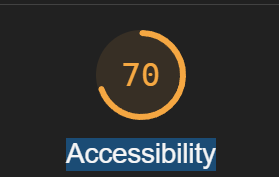

# Audit du site de Nina Carducci - photographe professionelle

## Premier résultat du site d'analyse avec Google Lighthouse

résultat général

## Analyse performance

### Diagnostics

- Largest Contentful - **_Paint element 16,190 ms_**
- Enable text compression - **_Potential savings of 371 KiB_**
- Eliminate render-blocking resources - **_Potential savings of 670 ms_**
- Minify CSS - **_Potential savings of 39 KiB_**
- Minify JavaScript - **_Potential savings of 79 KiB_**
- Reduce unused JavaScript - **_Potential savings of 203 KiB_**
- Reduce unused CSS - **_Potential savings of 203 KiB_**
- Serve images in next-gen formats - **_Potential savings of 9,851 KiB_**
- Properly size images - **_Potential savings of 24,869 KiB_**
- Efficiently encode images - **_Potential savings of 1,955 KiB_**
- Page prevented back/forward cache restoration - **_1 failure reason_**
- Image elements do not have explicit **width** and **height**
- Remove duplicate modules in JavaScript bundles - **_Potential savings of 1 KiB_**
- Avoid enormous network payloads - **_Total size was 30,704 KiB_**
- User Timing marks and measures - **_1 user timing_**
- Avoid large layout shifts - **_1 layout shift found_**
- Initial server response time was short - **_Root document took 0 ms_**
- Avoids an excessive DOM size - **_132 elements_**
- Avoid chaining critical requests - **_10 chains found_**
- JavaScript execution time - **_0.1 s_**
- Minimizes main-thread work - **_0.6 s_**
- Minimize third-party usage - **_Third-party code blocked the main thread for 0 ms_**
- Avoid long main-thread tasks - **_1 long task found_**

## Analyse Accessibility

### Names and labels

- Image elements do not have `[alt]` attributes
- Document doesn't have a `<title>` element
- Form elements do not have associated labels
- Links do not have a discernible name

### Contrast

- Background and foreground colors do not have a sufficient contrast ratio.
- Internationalization and localization html element does not have a lang attribute

### Navigation

- Heading elements are not in a sequentially-descending order

## Analyse Best Practices

## Analyse SEO

- Document doesn't have a `<title>` element
- Document does not have a meta description
- Image elements do not have `[alt]` attributes

---

## Audit pour la version mobile

## Diagnostics

- Largest Contentful Paint element - **_53,840 ms_**
- Eliminate render-blocking resources - **_Potential savings of 3,720 ms_**
- Enable text compression - **_Potential savings of 371 KiB_**
- Minify JavaScript - **_Potential savings of 79 KiB_**
- Reduce unused JavaScript - **_Potential savings of 203 KiB_**
- Minify CSS - **_Potential savings of 39 KiB_**
- Reduce unused CSS - **_Potential savings of 204 KiB_**
- Minimize main-thread work - **_2.8 s_**
- Serve images in next-gen formats - **_Potential savings of 9,851 KiB_**
- Properly size images - **_Potential savings of 21,920 KiB_**
- Defer offscreen images - **_Potential savings of 7,421 KiB_**
- Page prevented back/forward cache restoration - **_1 failure reason_**
- Image elements do not have explicit `width` and `height`
- Efficiently encode images - **_Potential savings of 1,955 KiB_**
- Remove duplicate modules in JavaScript bundles - **_Potential savings of 1 KiB_**
- Avoid enormous network payloads - **_Total size was 30,704 KiB_**
- Reduce the impact of third-party code - **_Third-party code blocked the main thread for 1,070 ms_**
- Avoids an excessive DOM size - **_132 elements_**
- Avoid long main-thread tasks - **_7 long tasks found_**
- Avoid large layout shifts - **_1 layout shift found_**
- User Timing marks and measures - **_1 user timing_**
- Initial server response time was short - **_Root document took 10 ms_**
- Avoid chaining critical requests - 10 chains found\*\*\*
- JavaScript execution time -**_ 0.5 s_**

---

---

Changement
SEO
* add `title` to head
* lang on html
* add meta description

accessibilty
* constrast of active link tous
* change header orders
* add for on label form
* alt to camera.jpg and nina.jpg
* add alt the all images

performance
* compress slide images
* compress all images
* add defer to script
* *lazy loading on img slide
* compression image slider en webp
* utiliser bootstap.min.css
* utiliser bootstrap.bundle.min.js
* link preload slider unsplash.webp
* remove bootstrap.bundle.min.js since no use?
* create a dev environment
* minify httl, css, js

deploy
* docker
* nginx + ngix compression